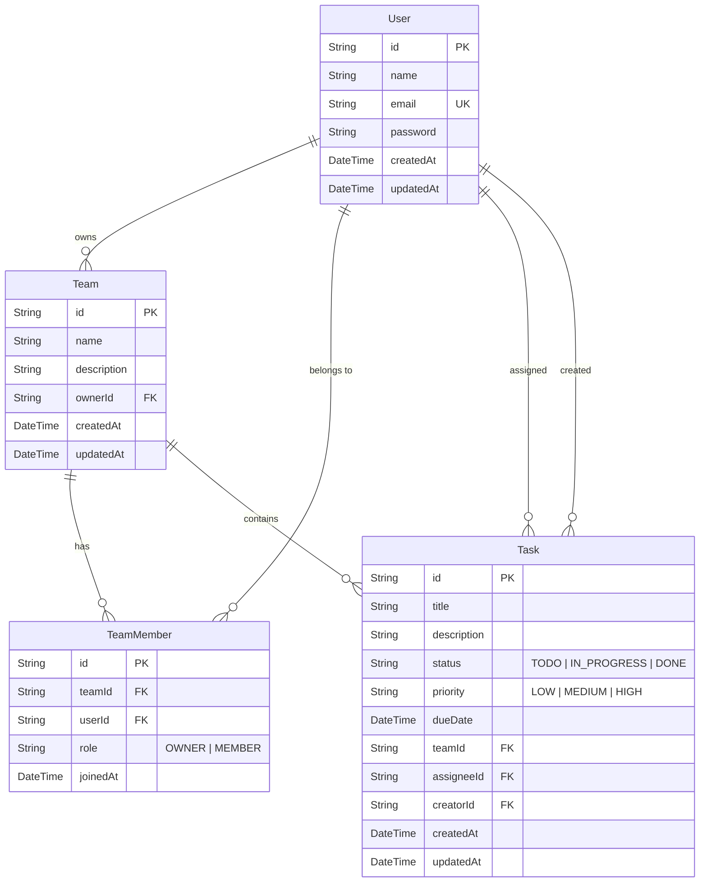

# TaskFlow - Task & Team Management Application

> **Assignment 2: Task & Team Management App: CRUD API with Authentication**  
> Built with Next.js (App Router, Route Handlers, TypeScript), Prisma ORM, PostgreSQL (Supabase), and Tailwind CSS.

---

## 🚀 Live Demo & Links
- **GitHub Repository**: [https://github.com/an2obanhmi/SDN302_1](https://github.com/an2obanhmi/SDN302_1)
- **Deployed Website (Vercel)**: *(Configured on Vercel)*

---

## 🔑 Demo & Test Account (For Automated Grading)
The application supports **self-registration with immediate login** (no confirmation email link needed), and includes pre-configured grading credentials:

- **Email**: `grader@test.com`
- **Password**: `Grader123@`
- **Role**: Team Owner (`Core Engineering Team`)
- **Status**: Ready to log in immediately

*(A second member account `alice@test.com` / `Alice123@` is also pre-seeded as a team member).*

---

## 🗄️ Relational Database Schema & ERD

The application uses **Prisma ORM** connected to a cloud **PostgreSQL** database on Supabase.

### Entity Relationship Diagram (ERD)



---

## 📡 RESTful CRUD API Endpoints

### 1. Authentication
| Method | Endpoint | Description | Access |
|---|---|---|---|
| `POST` | `/api/auth/register` | Register a new user | Public |
| `POST` | `/api/auth/login` | Login and receive JWT HTTP-only cookie | Public |
| `POST` | `/api/auth/logout` | Logout and clear session cookie | Authenticated |
| `GET` | `/api/auth/me` | Get current authenticated user profile | Authenticated |

### 2. Teams Management
| Method | Endpoint | Description | Access |
|---|---|---|---|
| `GET` | `/api/teams` | List all teams current user belongs to | Authenticated |
| `POST` | `/api/teams` | Create a new team (creator becomes `OWNER`) | Authenticated |
| `GET` | `/api/teams/:id` | Get team details, members, and tasks | Team Members |
| `PUT` | `/api/teams/:id` | Update team details (name, description) | **Team Owner Only** |
| `DELETE` | `/api/teams/:id` | Delete team and cascade associated tasks | **Team Owner Only** |

### 3. Team Members Management
| Method | Endpoint | Description | Access |
|---|---|---|---|
| `POST` | `/api/teams/:id/members` | Add a member to the team by email | **Team Owner Only** |
| `DELETE` | `/api/teams/:id/members/:userId` | Remove a member from the team | **Team Owner Only** |

### 4. Tasks Management
| Method | Endpoint | Description | Access |
|---|---|---|---|
| `GET` | `/api/teams/:id/tasks` | List tasks for a team (supports filter & search) | Team Members |
| `POST` | `/api/teams/:id/tasks` | Create a new task within the team | Team Members |
| `PUT` | `/api/tasks/:id` | Update task details, status, priority, or assignee | Team Members |
| `DELETE` | `/api/tasks/:id` | Delete a task | **Creator, Assignee, or Team Owner** |

---

## 🔒 Role-Based Authorization Matrix (RBAC)

| Action | Unauthenticated | Team Member | Team Owner |
|---|:---:|:---:|:---:|
| View Landing Page, Login, Register | ✅ | ✅ | ✅ |
| Access Dashboard / Teams | ❌ *(Redirects to Login)* | ✅ | ✅ |
| Create Team | ❌ | ✅ *(Becomes Owner)* | ✅ *(Becomes Owner)* |
| View Team Tasks & Members | ❌ | ✅ *(If in team)* | ✅ |
| Update Team Name / Description | ❌ | ❌ | ✅ |
| Delete Team | ❌ | ❌ | ✅ |
| Add Members by Email | ❌ | ❌ | ✅ |
| Remove Members | ❌ | ❌ | ✅ |
| Create Task | ❌ | ✅ | ✅ |
| Update Task Details & Status | ❌ | ✅ | ✅ |
| Delete Task | ❌ | ✅ *(Only Creator or Assignee)* | ✅ |

---

## 🌟 Bonus Features Implemented
- **Interactive Kanban Board**: Switch between list/table view and 3-column Kanban board (*To Do*, *In Progress*, *Done*).
- **Task Search & Multi-Criteria Filtering**: Filter tasks by Status (*To Do, In Progress, Done*) and Priority (*Low, Medium, High*).
- **One-Click Grader Login**: Dedicated quick-fill button on the login page for effortless test grading.
- **Sleek Minimalist Dark Mode**: Designed with `#0B0F19` slate-navy palette, pastel status badges, and accessible typography.
- **Automated CI/CD**: GitHub Actions workflow (`.github/workflows/ci.yml`) ensuring clean lint and production build on every push.

---

## 💻 Local Setup Instructions

### 1. Clone & Install Dependencies
```bash
git clone https://github.com/an2obanhmi/SDN302_1.git
cd SDN302_1
npm install
```

### 2. Configure Environment Variables
Copy `.env.example` to `.env` and fill in your Supabase connection strings:
```bash
cp .env.example .env
```

### 3. Push Database Schema & Seed Demo Data
```bash
npm run db:push
npm run db:seed
```

### 4. Run Development Server
```bash
npm run dev
```
Open [http://localhost:3000](http://localhost:3000) to view the application.
